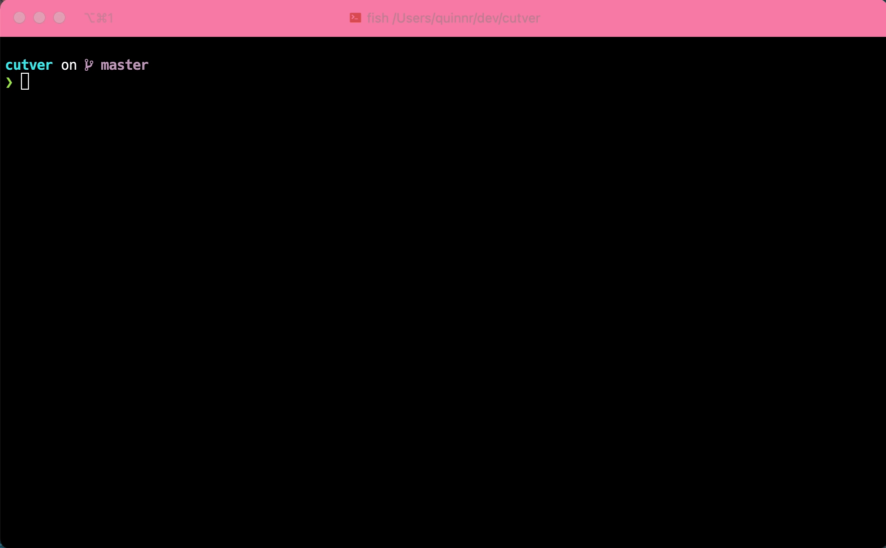

# cutver

For when you know what version to tag, and you want to cut a release in the annotated tag format.

## Installation
```bash
go install github.com/roryq/cutver@latest
```

## Usage
It is an interactive prompt that will populate the branch name and leave you to specify the tag. 
It assumes you are already on the correct branch and have fetched the latest changes.

Hit the `Tag and Push` button to execute the tag and push command, or ctrl+c or esc to exit.

